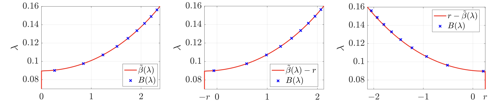
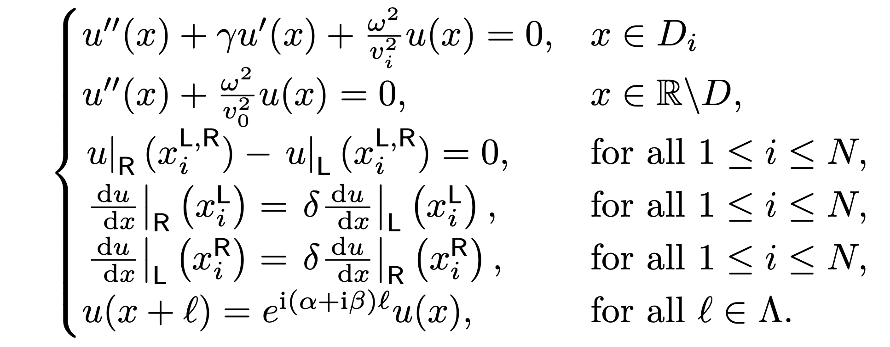

# Complex Band Structure for tridiagonal k-Toeplitz operators and subwavelength localisation in defected finite non-Hermitian systems

Authors: E. O. HILTUNEN and Y. DE BRUIJN

Date: 15.05.2025

------------------------------------------------------------------------------------------------------------------

In this computational notebook, we provide the MATLAB code for the computations in [1].

## Tridiagonal k-Toeplitz Operators:

- `Defect_Spectral_Convergence.m`

  

- `Regions_monomer_Band.m`
- This plot Qualitatively illustrates the behaviour of an eigenmode depending on its' eigenfrequency. 

  

## Complex Quasiperiodic Gauge Capacitance matrix:
We inverstigate the non-Hermitian skin effect under qusiperiodic boundary consitions

  

Where the resonators within the unit cell are denoted by $D_i$, and the overall resonator set is defined as $D := \bigcup_{i} D_i$. We define the contrast $\delta := \rho_1 / \rho_0$ as the ratio of the densities of the resonators to that of the background material. $\nu$ denoted the outwards facing normal derivative on the resonator surface.

### Subwavelength Regime
In a setting where $0 < \delta \ll 1$, we seek non-trivial eigenfrequencies for the Helmholtz scattering problem such that $\omega(\delta)\to 0$, as $\delta \to 0$.

#### Quasiperiodic Capacitance
In the subwavelength regime, the complex quasiperiodic capacitance matrix enables us to derive explicit formulas for the band and gap functions.
- `Monomer_Band_Surface.m`

  

- `Monomer_Band.m`

  

- `Dimer_Band.m`

  

## II. Defected Resonator chians  
A defected monomer chain of $N$ one-dimensional subwavelength resonators, with length $\ell$ and spacing $s$. The wave speed inside the resonators is $v = 1$ whereas in the defected resonator the speed is $\tilde{v} = 1 + \eta.$

  

- `Defected_Spectral_Convergence.m`

The defect supports an eigenfrequency within the bandgap. This defect eigenfrequency is highlighted in red.

  

- `Monomer_Band.m`

The decay lengths of the eigenmodes are numerically simulated for a range of defect sizes and overlayed (blue crosses) with the complex band structure.

  

- `Defected_Dimers.m`

  

- `Dimer_Band.m`

  

## III. Non-Hermitian tight-binding Hamiltonian 

- `Defect_modes_Non_Hermitian_Hamiltonian.m`

This plot qualitatively illustrates the different decay behaviours observed in the eigenmodes of non-Hermitian Hamiltonians. The shift from skin loclaised modes to bulk localised modes cna be fully understood using the Complex bandstructure.

  

## IV. References:
When using the code in the repository, please cite the following reference:

[1] De Bruijn, Y. and Hiltunen, E.O. (2025), *Complex Band Structure for tridiagonal k-Toeplitz operators and subwavelength localisation in defected finite non-Hermitian systems*.
