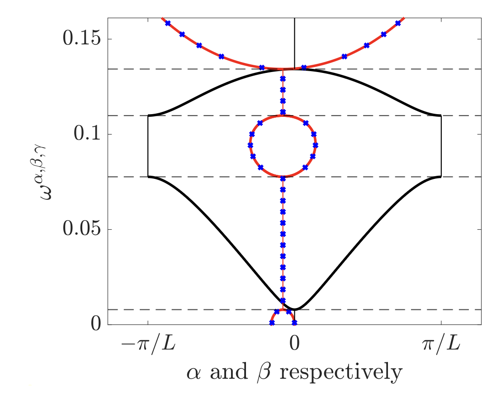

# Complex Band Structure for tridiagonal k-Toeplitz operators and subwavelength localisation in defected finite non-Hermitian systems

Authors: E. O. HILTUNEN and Y. DE BRUIJN

Date: 15.05.2025

------------------------------------------------------------------------------------------------------------------

In this computational notebook, we provide the MATLAB code for the computations in [1].

## Complex Quasiperiodic Gauge Capacitance matrix:

### Subwavelength Regime
In a setting where $0 < \delta \ll 1$, we seek non-trivial eigenfrequencies for the Helmholtz scattering problem such that $\omega(\delta)\to 0$, as $\delta \to 0$.

#### Quasiperiodic Capacitance
In the subwavelength regime, the complex quasiperiodic capacitance matrix enables us to derive explicit formulas for the band and gap functions.
- `Monomer_Band_Surface.m`

  

- `Monomer_Band.m`

  

- `Dimer_Band.m`

  

- `Regions_monomer_Band.m`

  

## II. Defected Resonator chians  
A defected monomer chain of $N$ one-dimensional subwavelength resonators, with length $\ell$ and spacing $s$. The wave speed inside the resonators is $v = 1$ whereas in the defected resonator the speed is $\tilde{v} = 1 + \eta.$

  

- `Defected_Spectral_Convergence.m`

  

- `Monomer_Band.m`

  

- `Defected_Dimers.m`

  

- `Dimer_Band.m`

  

## III. Non-Hermitian tight-binding Hamiltonian 

- `Defect_modes_Non_Hermitian_Hamiltonian.m`

  

## IV. References:
When using the code in the repository, please cite the following reference:

[1] De Bruijn, Y. and Hiltunen, E.O. (2025), *Complex Band Structure for tridiagonal k-Toeplitz operators and subwavelength localisation in defected finite non-Hermitian systems*.
